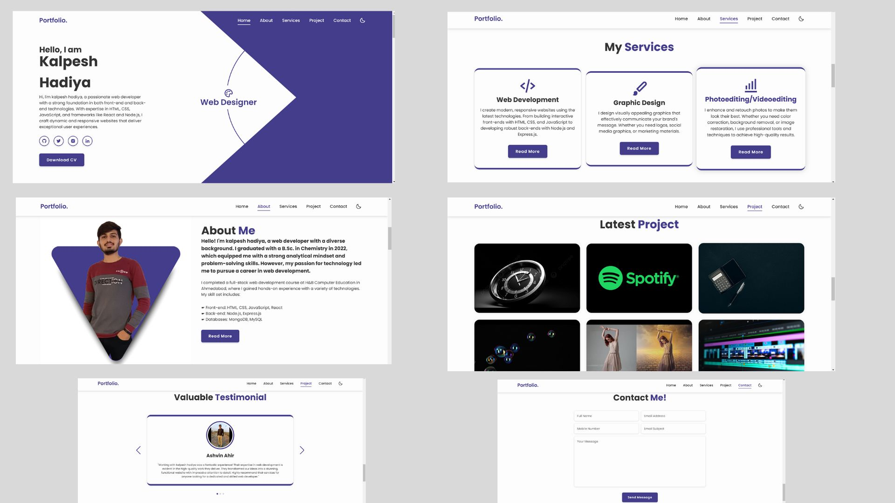

# My Portfolio Website

Welcome to my portfolio website! This site showcases my work as a web developer, including my projects, services, and more.

## Screenshots



## Live Demo

Check out the live demo of the website: [Portfolio Website](https://kalpeshhadiyaportfolio.netlify.app)

## Features

- Home Page: A brief introduction about me and my work.
- Download CV: Option to download my resume.
- About Me: Information about my background, skills, and experience.
- Technologies: A list of technologies and tools I am proficient in.
- Services: Details of the services I offer, such as web development, graphic design, and photo/video editing.
- Projects: A showcase of my 9 projects, each with descriptions and links.
- Testimonials: Feedback and testimonials from clients or collaborators.
- Contact Form: A form for visitors to get in touch with me.

## Technologies Used

- HTML
- CSS
- JavaScript
- Node.js
- Express.js
- React
- MongoDB/MySQL

## Getting Started

To set up the project locally, follow these steps:

1. Clone the repository:

   ```bash
   git clone https://github.com/yourusername/your-repo-name.git

2. Cd
   ```bash
   cd your-repo-name

    npm install

    npm start


### Customization Tips

1. Personal Details: Replace placeholder text like ahir0907, Kalpesh-Portfolio, and kalpeshhadiya2002@.gmailcom with your actual GitHub username, repository name, and email.

2. Project Structure: Adjust the Portfolio Structure section to reflect the actual structure of your project.

3. Additional Sections: You can add more sections if needed, such as Features, Future Improvements, Screenshots, Acknowledgments, etc.

4. Live Demo Link: Replace https://kalpeshhadiyaportfolio.netlify.app with the actual URL where your portfolio website is hosted. This could be a link to a live server, Netlify, GitHub Pages, or any other hosting platform you use.

5. Further Information: You can also include more details about specific sections or features of your website in the README.

Once you've updated the README with the correct live demo link and any other details, add it to your repository and push it to GitHub. If you need more help, feel free to ask!

Once you've customized the README, you can add it to your repository's root directory and push it to GitHub. Let me know if you need further assistance!